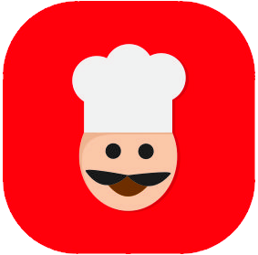

# GastroGraph 🍽️📈

Bienvenido a **GastroGraph**, tu nuevo sistema de recomendaciones de restaurantes basado en grafos. Utilizando la potencia de Java, JavaFX, Neo4j y AuraDB, GastroGraph te proporciona recomendaciones personalizadas para ayudarte a descubrir nuevos lugares para comer.

## Características 🌟

- **Recomendaciones personalizadas**: GastroGraph aprende de tus gustos y te proporciona recomendaciones de restaurantes que te encantarán.
- **Interfaz de usuario intuitiva**: Con nuestra interfaz de usuario JavaFX, encontrar tu próximo lugar favorito para comer es tan fácil como hacer clic en un botón.
- **Potente motor de grafos**: Utilizando Neo4j y AuraDB, GastroGraph crea un gráfico de tus preferencias culinarias para proporcionarte las mejores recomendaciones.

## Requisitos 💻

Para ejecutar GastroGraph, necesitarás:

- Java 8 o superior
- Neo4j
- AuraDB
- Conexión a internet
- 50 MB disponibles como mínimo en tu memoria de almacenamiento

## Cómo empezar 🚀

1. Clona este repositorio o descarga el archivo GastroGraph.jar.
2. Asegúrate de tener instalado Java en tu sistema operativo.
3. Configura tu base de datos Neo4j y AuraDB siguiendo las instrucciones de su respectivo sitio web.
4. Ejecuta `GastroGraph.java` para iniciar la aplicación.

## Contribuir 🤝

Nos encantaría que contribuyeras a GastroGraph. Por favor, lee nuestras [directrices de contribución](CONTRIBUTING.md) para empezar.

## Licencia 📄

GastroGraph está licenciado bajo la licencia MIT. Consulta el archivo [LICENSE](LICENSE) para obtener más detalles.

## Contacto 📧

Si tienes alguna pregunta o sugerencia, no dudes en abrir un problema o enviarnos un correo electrónico a gastograph@contact.com.

¡Disfruta de GastroGraph y descubre una nueva forma de explorar la gastronomía!

- **Recomendaciones personalizadas**: GastroGraph aprende de tus gustos y te sugiere restaurantes que te encantarán.
- **Interfaz de usuario intuitiva**: Con JavaFX, GastroGraph ofrece una experiencia de usuario fluida y atractiva.
- **Uso de grafos**: Utilizando Neo4j y AuraDB, GastroGraph crea un grafo de tus preferencias y las de otros usuarios para hacer recomendaciones más precisas.
